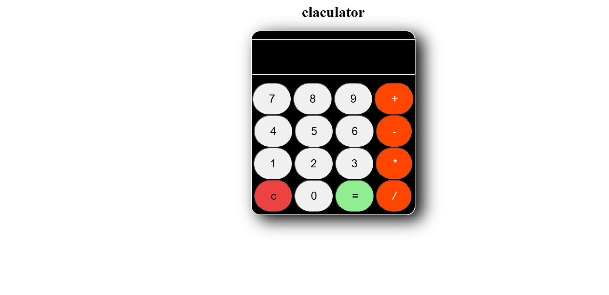

# Calculator Project

## Overview
The **Calculator Project** is a simple web-based calculator built using PHP. It allows users to perform basic arithmetic operations efficiently.

## Features
- **Basic Arithmetic Operations**: Supports addition, subtraction, multiplication, and division.
- **User-Friendly Interface**: Simple and intuitive design for easy usage.
- **PHP-Based Logic**: Backend processing to handle calculations dynamically.

## Directory Structure
```
└── ladevivek33-calculator/
    ├── README.md         # Project documentation
    ├── calculator.php    # Main PHP file handling calculations
```

## Installation
1. Clone the repository:
   ```sh
   git clone https://github.com/your-repo/ladevivek33-calculator.git
   ```
2. Navigate to the project directory:
   ```sh
   cd ladevivek33-calculator
   ```
3. Start a local PHP server:
   ```sh
   php -S localhost:8000
   ```
4. Open `http://localhost:8000/calculator.php` in your browser.

## Usage
1. Enter two numbers in the respective input fields.
2. Select an operation (Addition, Subtraction, Multiplication, Division).
3. Click the "Calculate" button to get the result.

## Screenshots
### Calculator Interface



## Contributing
Feel free to submit pull requests for improvements.


